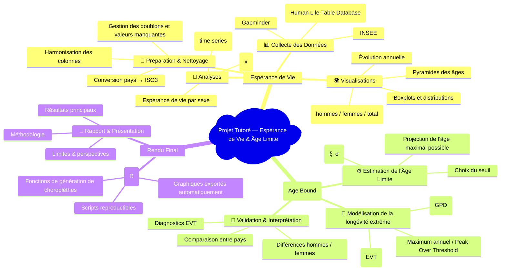

# life-expectancy
Life Expectancy and Age Bound

```mermaid
mindmap
  root)Projet Tutoré — Espérance de Vie & Âge Limite(
    
    Espérance de Vie
        📊 Collecte des Données
            HLD (Human Life-Table Database)
            Gapminder
            INSEE
        🧹 Préparation & Nettoyage
            Harmonisation des colonnes
            Gestion des doublons et valeurs manquantes
            Conversion pays → ISO3
        🔎 Analyses
            Espérance de vie par sexe
            Espérance de vie à différents âges e(x)
            Tendances temporelles (time series)
        🌍 Visualisations
            Cartes choroplèthes (hommes / femmes / total)
            Pyramides des âges
            Boxplots et distributions
            Évolution annuelle
    
    Limite d'Âge (Age Bound)
        📐 Modélisation de la longévité extrême
            Théorie des Valeurs Extrêmes (EVT)
            Loi de Pareto Généralisée (GPD)
            Maximum annuel / Peak Over Threshold
        ⚙️ Estimation de l'Âge Limite
            Choix du seuil
            Estimation des paramètres (ξ, σ)
            Projection de l’âge maximal possible
        🧪 Validation & Interprétation
            Diagnostics EVT
            Comparaison entre pays
            Différences hommes / femmes
    
    Rendu Final
        📁 Automatisation (R)
            Scripts reproductibles
            Fonctions de génération de choroplèthes
            Graphiques exportés automatiquement
        📝 Rapport & Présentation
            Méthodologie
            Résultats principaux
            Limites & perspectives
```
