# Life Expectancy and Age Limit


[](https://www.lifetable.de)
[](https://www.mortality.org)
[](https://www.supercentenarians.org)


## 🧭 Project Overview

This project investigates:
1. **Life Expectancy** trends across genders, countries and years.
2. **Human Lifespan Limit** estimation using Extreme Value Theory (EVT).

The workflow combines data processing, statistical analysis, geospatial visualization, and advanced mathematical modeling.

---

## 🥇 PART I — Life Expectancy Analysis

### 🎯 Objectives

- Compute and analyze **life expectancy at age x** for all available countries.  
- Study **temporal trends** from the earliest to the latest year of data.  
- Compare **male vs female** life expectancy gaps.  
- Build **global and country-specific visualizations**, including:
  - Time series
  - Boxplots and distributions
  - Choropleth world maps
  - Population pyramids  

---

### 📂 Data Used

- **Human Life-Table Database (HLD)** — primary source of life expectancy at birth data.
- **Human Mortality Database (HMD)** — complementary country-level mortality and demographic indicators.

All datasets were cleaned, harmonized, and matched using standardized country names and ISO3 codes prior to analysis.  
No raw data from these sources is redistributed in this repository.


---

### 🧹 Data Processing

- Removal of duplicates, missing values, and inconsistent entries  
- Selection of relevant variables:  
  **Country**, **Year**, **Age**, **Sex**, **eₓ**  
- Normalization of variable names and formats  
- Standardization of country names using **ISO3 codes**, including:
  - Automatic detection via pattern matching  
  - Conversion using the `countrycode` package  
  - Manual corrections for problematic territories such as:  
    **Kosovo**, **Indian Ocean Territories**,  
    **Ashmore and Cartier Islands**,  
    **Siachen Glacier**  
- Merging all cleaned datasets into a unified analytical dataset  

---

### 📊 Analyses Performed

- Distribution of life expectancy by **age** and **sex**  (boxplot, histogram)
- Time series analysis of life expectancy trends: Sex gap analysis (Female − Male), Cross-country comparisons  
- Regional or continent-level comparisons  (choropleth maps)

---

## 🥈 PART II — Human Maximum Lifespan (Age Bound)

### 🎯 Objectives

- Estimate the **theoretical maximum age** a human can reach.  
- Analyze **deaths at extreme ages**.  
- Apply **Extreme Value Theory (EVT)** to model exceptional lifespans.  
- Compare results **across countries** and **between sexes** (male vs female).  

---

### 📂 Data Used

- **International Database on Longevity (IDL)** — detailed longevity and extreme-age demographic data (used for extreme values analysis and future estimation of human lifespan limit).

---

### ⚙️ EVT Methodology

#### 1. Threshold Selection  
Select an optimal threshold **u** to retain only the most extreme age-at-death values.  
Multiple diagnostic tools (mean excess plots, stability plots) are used to choose a robust threshold.

#### 2. Modeling with the Generalized Pareto Distribution (GPD)  
The exceedances over the threshold are modeled using the **Generalized Pareto Distribution (GPD)**.  

We estimate the following parameters:

- **ξ (xi)** — shape parameter  
- **σ (sigma)** — scale parameter  

**Interpretation of ξ**:  
- **ξ < 0** → finite upper bound (suggests a maximum human lifespan)  
- **ξ ≥ 0** → no detectable upper limit to lifespan  

#### 3. Age Bound Estimation  
Using the fitted GPD model, we compute the **theoretical maximal age** (upper endpoint) implied by the data.

#### 4. Diagnostic Tools  
To validate the GPD fit and the threshold choice, we rely on:

- **Q-Q plots**  
- **Stability plots** for ξ  
- **Threshold sensitivity analysis**

---




```mermaid
mindmap
  root) Human Life Expectancy & Lifespan Limit(
    
    Life Expectancy
        📊 Data Collection
            HLD (Human Life-Table Database)
            HMD (Human Mortality Database)
            
        🧹 Data Preparation & Cleaning
            Column harmonization
            Handling duplicates & missing values
            Country → ISO3 conversion
            
        🔎 Analysis
            Life expectancy by sex
            Life expectancy at different ages e(x)
            Temporal trends (time series)
            
        🌍 Visualizations
            Choropleth maps (male / female / total)
            Population pyramids
            Boxplots & distributions
            Yearly evolution
    
    Age Limits
        📊 Data Collection
            IDL (International Database on Longevity)
            
        📐 Extreme Longevity Modeling
            Extreme Value Theory (EVT)
            Generalized Pareto Distribution (GPD)
            Annual maximum / Peak Over Threshold
            
        ⚙️ Age Limit Estimation
            Threshold selection
            Parameter estimation (ξ, σ)
            Projection of maximum possible age
            
        🧪 Validation & Interpretation
            EVT diagnostics
            Cross-country comparisons
            Sex differences
    
    Final Deliverables
        📁 Automation (R)
            Reproducible scripts
            Choropleth generation functions
            Automatic plot export
            
        📝 Report & Presentation
            Methodology
            Key results
            Limitations & future directions

```

## 🧱 Project Structure

```bash
life
📁 data/
    HLD_database.csv             # You should upload the data yourself from the official site
    

📁 scripts/
    plot_functions.R             # Ongoing
    map_utils.R                  # Ongoing
    evt_age_bound.R              # Future
                 

📄 README.md

```

## 📊 Data Source and Acknowledgment

This project uses data from the **Human Life-table Database (HLD)**, maintained by the **Max Planck Institute for Demographic Research**.

🌐 [https://www.lifetable.de](https://www.lifetable.de)

The HLD database provides high-quality life table data for multiple countries and time periods and is widely used in demographic research.

---

⚠️ **Important:**  
The HLD dataset is **not included** in this repository due to data usage and redistribution restrictions.

Please refer to `data/README.md` for instructions on how to obtain the data.

---

📌 **Citation:**  
If you use this project or its results, please cite the HLD database appropriately.
